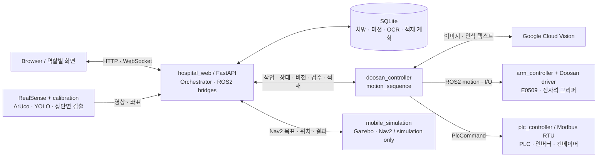

# RoToSY

약품 집기·검수·적재와 AMR 배송 시뮬레이션을 연결하는 ROS2 병원 물류 프로젝트.

## Overview

RoToSY는 처방에 따라 약품을 꺼내 OCR로 약품명을 확인하고, 병동별 배송 박스에 적재합니다.
Doosan E0509, 전자석 그리퍼, RealSense, PLC·컨베이어 제어와 FastAPI 웹 관제를 포함합니다.
약품 집기·적재는 실장치 연결을 전제로 하며, AMR 배송은 Gazebo·Nav2 시뮬레이션입니다.

**[Demo video — KG KAIROS 7 - 병원 약국 물류 자동화 시스템 데모](https://youtu.be/MdKExcUtkrw)**

화면별 조작과 상태 해석은 [Hospital Web 사용 가이드](hospital_web/docs/guide.html)를 참고하세요.

## Key Capabilities

| 영역 | 현재 구현 |
|---|---|
| Perception and calibration | RealSense RGB-D, ArUco, YOLO와 상단면 검출로 집기 좌표를 구합니다. 카메라·캐비닛·서랍 보정 도구를 제공합니다. |
| Manipulation and OCR verification | 로봇팔과 전자석 그리퍼로 서랍을 열고 약품을 집습니다. Google Cloud Vision OCR 결과를 처방 약품명과 대조합니다. |
| PLC/conveyor integration | Modbus RTU로 PLC·인버터를 제어합니다. OCR 불일치·확인 불가 약품은 컨베이어로 보냅니다. |
| Palletizing | 약품 치수와 박스 크기로 `rectpack` 배치를 계획합니다. 박스 마커로 위치를 구하고 슬롯별 적재를 기록합니다. |
| AMR simulation | Gazebo 병원 월드에서 Nav2 목표 이동, AMCL 위치 추정, 적재함 뚜껑 제어를 수행합니다. |
| Hospital web monitoring | 역할별 화면에서 영상·로봇·배송·온습도를 조회합니다. 처방·OCR·적재·이력은 SQLite에 저장합니다. |

## System Architecture



`hospital_web`이 영상과 로봇팔·AMR용 ROS2 bridge를 관리합니다. 별도 `web_interface` 서버는 필요하지 않습니다.
그림은 주요 작업 경로입니다. 웹의 수동 제어는 로봇팔·PLC에 직접 명령을 보낼 수 있습니다.

## Operational Workflow

[Orchestrator](hospital_web/backend/orchestrator.py)를 통한 자동 작업 순서입니다.

1. 간호사가 처방을 등록하고 약사가 승인합니다. 간호사가 배송을 요청합니다.
2. 관리자가 작업을 시작합니다. 약품별 서랍 설정과 수량으로 집기 큐·적재 계획을 만듭니다.
3. 마커와 보정값으로 손잡이 위치를 구해 서랍을 엽니다.
4. YOLO·깊이·상단면 검출로 집기점을 정합니다. 약품을 집어 OCR 촬영 자세로 이동합니다.
5. 약품명이 처방과 같으면 박스에 적재합니다. 다르거나 확인할 수 없으면 컨베이어로 보내고 실패를 보고합니다.
6. 서랍을 닫고 홈으로 복귀합니다. 정상 처리 시 남은 수량을 반복하고, 전체 집기 후 약사·관리자의 적재 확인을 기다립니다.
7. 양쪽의 적재 확인이 끝나면 AMR 시뮬레이터에 병동 목표를 보냅니다. 도착 후 수령 확인을 기다리지 않고 약재실 복귀를 요청합니다.

## Repository Structure

| Package / directory | 역할 | 실행 진입점 |
|---|---|---|
| [doosan_controller](doosan_controller/) | 로봇팔 제어, 집기·OCR·적재 시퀀스 | `launch/robot_controller.launch.py` |
| [hospital_web](hospital_web/) | 웹 관제, orchestrator, 비전·DB. ROS2 package가 아닌 웹 앱 | `backend/main.py` |
| [plc_controller](plc_controller/) | PLC·인버터 Modbus RTU 제어 | `plc_controller_node` |
| [robot_arm_interfaces](robot_arm_interfaces/) | 로봇팔·PLC용 message, service, action | 인터페이스 정의 |
| [rotosy_calibration](rotosy_calibration/) | ArUco camera extrinsic, TF, 접촉 보정 | `launch/` 및 보정 도구 |
| [rotosy_gripper_control](rotosy_gripper_control/) | 전자석 그리퍼 I/O·키보드 조작 예제 | `launch/keyboard_electromagnet_gripper.launch.py` |
| [mobile_simulation](mobile_simulation/) | Gazebo 월드·배송 로봇·Nav2 설정 | `launch/mobile_simulation.launch.py` |
| [web_interface](web_interface/) | **Legacy / compatibility component.** 이전 독립 웹 제어·비전 코드 | 현재 통합 launch에서 사용하지 않음 |

## Requirements

- **기본 환경:** Ubuntu/Linux, ROS2 Humble, Python 3.10, `colcon`.
- **로봇팔:** 외부 Doosan ROS2 driver의 `dsr_bringup2`, `dsr_msgs2`. 실장치는 E0509 연결과 그리퍼 배선이 필요합니다.
- **카메라:** RealSense SDK, `pyrealsense2`, ArUco 지원 OpenCV. ROS2 카메라 보정에는 `realsense2_camera`가 필요합니다.
- **웹·OCR·PLC:** [requirements.txt](hospital_web/backend/requirements.txt), `google-cloud-vision`, `pymodbus`. PLC 코드는 `slave=` 인자를 지원하는 버전이 필요합니다.
- **AMR 시뮬레이션:** Gazebo Classic 11, `gazebo_ros`, `nav2_bringup`, `turtlebot3_gazebo`, `turtlebot3_navigation2`, `robot_state_publisher`. 카메라 뷰는 `rqt_image_view`를 사용합니다.

## Quick Start

### 1. Workspace build — 장치 실행 없음

외부 driver와 위 의존성이 준비된 환경의 빌드 예시입니다.
driver를 별도 workspace에 설치했다면 해당 환경도 먼저 source하세요.

```bash
mkdir -p ~/rotosy_ws/src
cd ~/rotosy_ws/src
git clone https://github.com/Filaner/RoToSY.git
cd ~/rotosy_ws
source /opt/ros/humble/setup.bash
/usr/bin/python3 -m pip install -r src/RoToSY/hospital_web/backend/requirements.txt
colcon build --symlink-install
source install/setup.bash
```

통합 launch는 웹 서버에 `/usr/bin/python3`을 사용합니다.
위 `pip` 명령은 웹 requirements만 설치합니다. driver·RealSense·OCR·PLC 의존성, 모델과 인증은 별도로 준비해야 합니다.

### 2. Integrated robot stack — 실장치 연결

아래 Configuration을 완료한 뒤 실행하세요. `host`와 `plc_port`는 실제 연결 정보로 바꿉니다.
**실제 로봇·PLC 연결과 카메라 캡처를 시작합니다. 웹 조작과 작업 요청은 장치를 움직일 수 있습니다.**

```bash
source /opt/ros/humble/setup.bash
source ~/rotosy_ws/install/setup.bash
ros2 launch doosan_controller robot_controller.launch.py \
  mode:=real host:=110.120.1.52 plc_port:=/dev/ttyUSB0
```

Doosan driver, PLC·arm controller, TCP monitor, 웹 서버와 작업 시퀀스가 함께 실행됩니다.
관리자 화면은 `http://localhost:8080/`, API 명세는 `/docs`입니다. 나머지 화면은 [사용 가이드](hospital_web/docs/guide.html)를 참고하세요.

새 DB에는 약품·서랍 설정, 치수, 병동 좌표 등 작업 데이터를 넣어야 합니다.
[demo_create.py](hospital_web/backend/demo_create.py)는 시연 데이터를 DB에 기록합니다. `--reset`은 기존 데이터를 삭제합니다.

`mode:=virtual`은 Doosan driver에만 적용됩니다. PLC·카메라는 가상화하지 않습니다.
Doosan 가상 driver 환경도 별도로 필요합니다.

### 3. AMR simulation — Gazebo 내 주행

별도 터미널에서 실행합니다. 로봇팔·PLC 통합 스택은 시작하지 않습니다.

```bash
source /opt/ros/humble/setup.bash
source ~/rotosy_ws/install/setup.bash
ros2 launch mobile_simulation mobile_simulation.launch.py
```

- 기본값은 목표 요청 대기입니다. 단독 이동 데모는 `auto_start_demo:=true`를 추가합니다.
- 웹과 연결하려면 DB의 병동 목표 좌표를 시뮬레이션 월드에 맞춥니다.
- 화면 없이 실행하려면 `show_gazebo_client:=false show_camera_view:=false`를 추가합니다.

## Configuration

사용자가 제공하거나 실제 장치에 맞춰 보정할 항목입니다.

| 항목 | 준비 내용 |
|---|---|
| YOLO weights | `ROTOSY_VISION_MODEL`에 모델 경로 지정. [모델 로더](hospital_web/backend/vision_detector.py)는 `backend/models/best.pt`도 탐색합니다. weights는 저장소에 없습니다. |
| Camera extrinsic | 실측한 `camera_extrinsic.yaml`. `ROTOSY_CALIBRATION_CONFIG_DIR`로 디렉터리를 지정합니다. [형식 예시](rotosy_calibration/config/camera_extrinsic.example.yaml) 참고 |
| Cabinet calibration | [캐비닛 기하](doosan_controller/config/cabinet_geometry.yaml)와 [서랍별 TCP 보정](doosan_controller/config/drawer_tcp_calibration.yaml). 설정 디렉터리는 `ROTOSY_DOOSAN_CONFIG_DIR`로 지정할 수 있습니다. |
| Robot / PLC connection | launch의 `host`, `plc_port`와 [plc.yaml](plc_controller/config/plc.yaml). 배선·국번·시리얼 통신 조건을 확인합니다. |
| Google Cloud credentials | `GOOGLE_APPLICATION_CREDENTIALS`와 Cloud Vision 사용 권한. [motion_sequence.py](doosan_controller/doosan_controller/motion_sequence.py)의 `GOOGLE_PROJECT_ID` 상수도 사용할 프로젝트에 맞춰야 합니다. |
| 작업 데이터·적재 좌표 | 약품 치수·수량·서랍, 배송 박스, 병동 좌표를 DB에 등록합니다. 시퀀스의 경유점과 박스 바닥 높이는 재측정합니다. |

## Current Scope and Limitations

- **장치 의존성:** 보정값과 경유점은 특정 배치를 전제로 합니다. 장치나 배치가 달라지면 다시 보정해야 합니다.
- **외부 설정:** driver·weights·카메라 환경·Cloud 인증은 별도 준비 항목입니다. Quick Start만으로 전체 환경이 갖춰지지는 않습니다.
- **시뮬레이션 범위:** AMR 실행 구성은 Gazebo·Nav2용입니다. 실물 배송이나 병원 운영 검증은 확인할 수 없습니다. 웹의 mock 상태도 실제 주행 결과가 아닙니다.
- **OCR 범위:** 정규화한 약품명과 인식 텍스트를 문자열로 대조합니다. 용량·수량이나 투약 적합성을 검증하지 않습니다.
- **관제 범위:** PLC 명령 전송은 구현되어 있지만 웹의 PLC 상태는 `DISCONNECTED`로 고정됩니다. 역할별 화면에도 API 인증·권한 검증은 연결되어 있지 않습니다.
- **문서 기준:** 일부 하위 문서에는 이전 구조가 남아 있습니다. 이 README와 [사용 가이드](hospital_web/docs/guide.html)를 참고하되, 실행 동작은 launch와 코드를 기준으로 확인하세요.

## License

루트 `LICENSE` 파일은 없습니다. ROS2 package manifest의 `Apache-2.0` 표기를 저장소 전체의 라이선스로 단정하지 않습니다.
